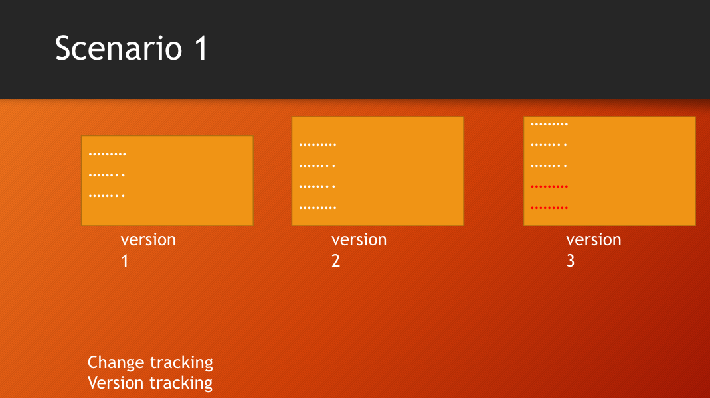
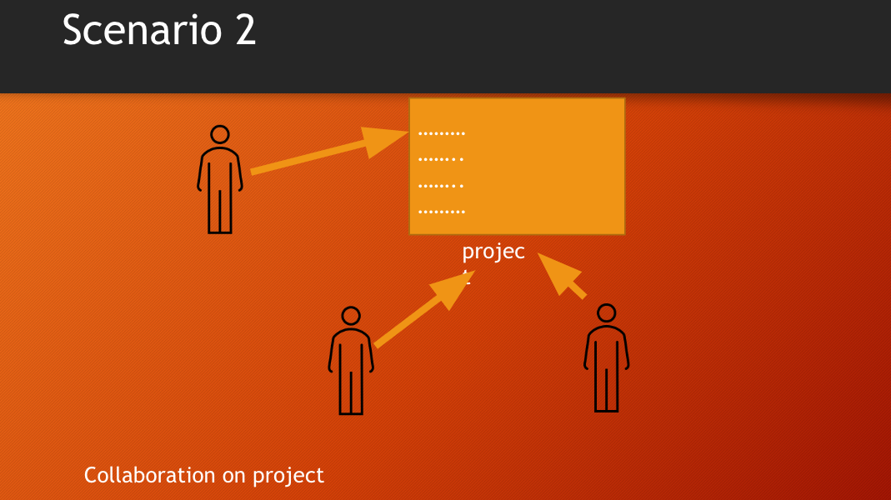

# Git & GitHub Documentation

## Table of Contents

- [Beginner Part](#beginner-part)

  - [1. Introduction to git and GitHub](#1-introduction-to-git-and-github)
    - [1.1 Why do we need Git?](#11-why-do-we-need-git)
    - [1.2 Git VS GitHub](#12-git-vs-github)

  - [2. Git environment setup and configuration](#2-git-environment-setup-and-configuration)
    - [2.1 Create a GitHub Account](#21-create-a-github-account)
    - [2.2 Download and install Git](#22-download-and-install-git)
    - [2.3 Git help and common commands](#23-git-help-and-common-commands)
    - [2.4 Git configuration and aliases](#24-git-configuration-and-aliases)
    - [2.5 What is SSH? How to setup SSH?](#25-what-is-ssh-how-to-setup-ssh)
  
  - [3. Basic Git Concepts](#3-basic-git-concepts)

    - [3.1 Git repo and adding files](#31-git-repo-and-adding-files)
    - [3.2 Git staging area](#32-git-staging-area)
    - [3.3 Git commit & uncommit](#33-git-commit--uncommit)
    - [3.4 Basic Commands & workflow](#34-basic-commands--workflow)
    - [3.5 Git ignore](#35-git-ignore)

  - [4. GitHub Basics & Collaborating with Git](#4-github-basics--collaborating-with-git)

    - [4.1 Create github repository and commits](#41-create-github-repository-and-commits)
    - [4.2 Connecting local repo to remote repo](#42-connecting-local-repo-to-remote-repo)
    - [4.3 Push and Pull](#43-push-and-pull)
    - [4.4 Working with Remotes](#44-working-with-remotes)
    - [4.5 README.md](#45-readmemd)
    - [4.6 GitHub Issues => create video](#46-github-issues--create-video)

- [Intermediate Part](#intermediate-part)

  - [1. Undoing Changes - checkout, reset, revert => create video](#1-undoing-changes---checkout-reset-revertneed-videos)
  - [2. Branching and merging](#2-branching-and-merging)
    - [2.1 What is Branching & Merging](#21-what-is-branching--merging)
    - [2.2 Basic commands for branching & merging](#22-basic-commands-for-branching--merging)
    - [2.3 Types of Merges: 2-way and 3-way merges](#23-types-of-merges-2-way-and-3-way-merges)
    - [2.4 Resolve Merge Conflicts](#24-resolve-merge-conflicts)
    - [2.5 best practice (create video)](#25-best-practice-create-video)
    - [2.6 git merge vs git rebase](#26-git-merge-vs-git-rebase)
  - [3 Advanced Git Commands (stash and tag) => create video](#3-advanced-git-commands-stash-and-tag--create-video)
    - [3.1 Git Stash](#31-git-stash)
    - [3.2 Git Tags](#32-git-tags)
  - [4. GitHub Advanced Features => Create Video](#4-github-advanced-features--create-video)

- [Advanced Part](#advanced-part)

  - [1. Advanced Branching Strategies => Create Video](#1-advanced-branching-strategies--create-video)
  - [2. Git rebase (interactive rebase) => Create Video](#2-git-rebase-interactive-rebase--create-video)
  - [3. Shallow clones => Create Video](#3-shallow-clones--create-video)
  - [4. GitHub Enterprise => Create Video](#4-github-enterprise--create-video)
  - [5. Code reviews and best practices => Create Video](#5-code-reviews-and-best-practices--create-video)
  - [6. Understanding the .git directory => Create Video](#6-understanding-the-git-directory--create-video)

- [Learning Resource => Create Video](#learning-resource--create-video)

## Beginner Part

### [1. Introduction to Git and GitHub](https://youtu.be/ulTs4vqOzyo)

#### 1.1 Why do we need Git?




- Change Control (add/restore)
- Version Control (Commits)
- Collaboration (parallel development)

#### 1.2 Git VS GitHub


##### Git

- git is a version control software
- It keep track of code changes
- It helps to collaborate in a project
- It is installed and maintained locally
- It provides Command Line Interface (CLI)
- Released in April 7, 2005
- Developed by Linus Torvalds & Junio C Hamano

##### Github

- GitHub is a hosting service where we can keep our git repositiory/folders
- It is maintained on cloud/web
- It provides Graphical User Interface (GUI)
- Founded in 2008

### [2. Git environment setup and configuration](<https://youtu.be/vj5-nkhTRbo>)

#### 2.1 Create a GitHub Account

- go to this [site](https://github.com/) and register with a valid email address.

#### 2.2 Download and install Git

- Download and install git on your pc: <https://git-scm.com/>
- check git version: open terminal or cmd then use the command `git --version` to find out whether git is installed or not. if git is installed it will return a version number of git.

#### 2.3 Git help and common commands

`git commandName -help`

##### Windows Command Prompt / Windows PowerShell / Mac Terminal (Bash/Zsh)

- directoy/folder
  - dir/ls/ls – List directory contents.

  - cd – Change directory.

  - cd/Get-Location/pwdShow current directory

  - mkdir – Create a new directory. Example: mkdir directory

  - rmdir/Remove-Item/rm – Remove a directory.

    Example:

    rmdir /S /Q directory

    Remove-Item -Recurse directory

    rm -r directory

- File
  - copy/New-Item/touch- Create file. Example: copy nul filename.txt / New-Item -ItemType File -Name "filename.txt" / touch filename.txt
  - echo Your content here > filename.txt / "Your content here" | Out-File -FilePath "filename.txt" / echo Your content here > filename.txt -  Writing in a file.
    - in mac

    ```zsh
    cat > filename.txt
    Your content here
    Another line of content
    Ctrl + D

    or printf "Your content here\n" > filename.txt

    to append
    printf "Additional content\n" >> filename.txt

    ```

  - type/Get-Content/cat - View file contents. Example: type file / Get-Content file / cat file

  - copy/Copy-Item/cp – Copy files. Example: copy source destination / Copy-Item source destination/cp source destination

  - del/Remove-Item/rm– Delete files. Example: del file / Remove-Item file / rm file

- cls/Clear-Host/clear – Clear the screen.

- echo – Display a message or turn command echoing on or off. Example:
echo text / Write-Output text / echo text

#### 2.4 Git configuration and aliases

Git configuration is an important part of setting up and managing your Git environment. Configuration settings in Git can be set at three different levels: local, global, and system.

- **Local configuration** applies only to a specific repository.
- **Global configuration** applies to the user across all repositories on the system.
- **System configuration** applies to all users on the system (rarely used).

To view configuration settings:

```bash
git config --list
git config --local --list (view local configuration settings)
git config --global --list (view global configuration settings
git config --system --list (view system configuration settings)
```

If you want to remove a specific configuration setting in Git, such as a user name set with `git config`, you can use the `git config --unset` command. Here’s how to remove a configuration setting:

##### Removing a Configuration Setting

```bash
cd /path/to/your/repository
git config --local --unset user.name
git config --global --unset user.name
sudo git config --system --unset user.name
```

##### Local Configuration

Local configuration settings are stored in the `.git/config` file within a specific repository. Use `.git/config` commad to see what you have inside the file.

To set local configuration options:

```bash
cd /path/to/your/repository
git config --local user.name "Your Name"
git config --local user.email "your.email@example.com"
```

##### Global Configuration

Global configuration settings are stored in the `~/.gitconfig` file (or `~/.config/git/config` depending on the system). Use `open ~/.gitconfig` commad to see what you have inside the file.

To set global configuration options:

```bash
git config --global user.name "Your Name"
git config --global user.email "your.email@example.com"
```

##### System Configuration

System configuration settings are stored in the `/etc/gitconfig` file.

To set system configuration options (requires administrative privileges):

```bash
sudo git config --system core.editor "nano"
```

##### Common Configuration Options

Here are some commonly used Git configuration options:

1. **User Information**
   - Set the name and email address that will be used for your commits.

   ```bash
   git config --global user.name "Your Name"
   git config --global user.email "your.email@example.com"
   ```

2. **Default Editor**
   - Set the default text editor for Git.

   ```bash
   git config --global core.editor "nano"  # or "vim", "code --wait", etc.
   ```

3. **Line Endings**
   - Configure how Git handles line endings between different operating systems.

   ```bash
   git config --global core.autocrlf input  # Use "true" on Windows, "input" on macOS/Linux
   ```

4. **Merge Tool**
   - Set the default merge tool for resolving conflicts.

   ```bash
   git config --global merge.tool "meld"
   ```

5. **Diff Tool**
   - Set the default diff tool for viewing differences.

   ```bash
   git config --global diff.tool "meld"
   ```

6. **Aliases**
   - Create shortcuts for commonly used Git commands.

   ```bash
   git config --global alias.co "checkout"
   git config --global alias.br "branch"
   git config --global alias.ci "commit"
   git config --global alias.st "status"
   ```

##### Viewing and Editing Configuration Files Directly

You can also directly view and edit the configuration files if needed:

- **Global configuration file**:

  ```bash
  nano ~/.gitconfig
  ```

- **Local configuration file**:

  ```bash
  nano .git/config
  ```

- **System configuration file** (requires administrative privileges):

  ```bash
  sudo nano /etc/gitconfig
  ```

##### Example

Here is an example of what a typical global configuration file (`~/.gitconfig`) might look like:

```ini
[user]
    name = Your Name
    email = your.email@example.com
[core]
    editor = nano
    autocrlf = input
[merge]
    tool = meld
[diff]
    tool = meld
[alias]
    co = checkout
    br = branch
    ci = commit
    st = status
```

##### Summary

By configuring Git at the local and global levels, you can customize your Git environment to suit your preferences and workflow. Local configuration settings are specific to individual repositories, while global settings apply across all repositories for a user. Understanding and managing these settings will help you streamline your Git operations and improve your productivity.

#### 2.5 What is SSH? How to setup SSH?

- SSH, or Secure Shell, is a cryptographic network protocol used for secure communication between devices over an unsecured network. It provides a secure way to access remote systems, execute commands, transfer files, and manage network infrastructure.
- SSH allows users to securely log into remote systems and execute commands as if they were sitting in front of the machine.

- go to your github account
- [setup ssh](https://youtu.be/ykLd4YQMzCo?si=hS4bShi16XfD4n5y) :
  - type in terminal `for generating SSH Key: ssh-keygen -t ed25519 -C "your email goes here"`
  - type in terminal `cat ~/.ssh/id_ed255519.pub`
  - copy the ssh and add to github

The command `ssh-keygen -t ed25519 -C "your email goes here"` is used to generate a new SSH key pair (a public and private key) for secure authentication. Here’s a detailed breakdown of the command:

###### Breakdown of the Command

1. **`ssh-keygen`**:
   - This is the command-line tool used to generate, manage, and convert authentication keys for SSH.

2. **`-t ed25519`**:
   - The `-t` option specifies the type of key to create.
   - `ed25519` refers to the Ed25519 algorithm, which is a modern and secure elliptic-curve algorithm for SSH keys. It is known for its high security, performance, and small key size compared to older algorithms like RSA.

3. **`-C "your email goes here"`**:
   - The `-C` option adds a comment to the key. This comment is typically used to identify the key.
   - `"your email goes here"` is the comment that will be added to the key. It's common to use your email address here, so you can easily identify the key later.

###### What Happens When You Run the Command

1. **Prompt for a File Location**:
   - After running the command, you will be prompted to specify a file to save the key. By default, it will suggest a location such as `~/.ssh/id_ed25519`.
   - If you press Enter without specifying a location, it will use the default path.

2. **Prompt for a Passphrase**:
   - You will be asked to enter a passphrase. This is an optional step, but adding a passphrase provides an additional layer of security. If you choose to set a passphrase, you’ll need to enter it whenever you use the private key.
   - If you do not want to set a passphrase, you can press Enter without typing anything.

3. **Key Generation**:
   - The tool generates a new Ed25519 key pair and saves it to the specified file. The private key is stored in the file you specified (e.g., `~/.ssh/id_ed25519`), and the public key is stored in a file with the same name but with a `.pub` extension (e.g., `~/.ssh/id_ed25519.pub`).

###### Example Output

When you run the command, the interaction might look like this:

```sh
$ ssh-keygen -t ed25519 -C "your_email@example.com"
Generating public/private ed25519 key pair.
Enter file in which to save the key (/home/yourusername/.ssh/id_ed25519):
Enter passphrase (empty for no passphrase):
Enter same passphrase again:
Your identification has been saved in /home/yourusername/.ssh/id_ed25519.
Your public key has been saved in /home/yourusername/.ssh/id_ed25519.pub.
The key fingerprint is:
SHA256:examplefingerprint your_email@example.com
The key's randomart image is:
+--[ED25519 256]--+
|       ..o.      |
|      .+ +       |
|     . o* .      |
|      o.O        |
|      .=S o      |
|    . + . = .    |
|     + o + . o   |
|      + o + .    |
|       o o..     |
+----[SHA256]-----+
```

###### Using the Generated SSH Key

1. **Add the Public Key to the Remote Server**:
   - Copy the contents of the public key file (e.g., `~/.ssh/id_ed25519.pub`) to the `~/.ssh/authorized_keys` file on the remote server you want to access.
   - You can use the `ssh-copy-id` command for this:

     ```sh
     ssh-copy-id -i ~/.ssh/id_ed25519.pub user@remote_host
     ```

2. **Connect Using SSH**:
   - Use the SSH command to connect to the remote server. SSH will use your private key for authentication.

     ```sh
     ssh user@remote_host
     ```

### [3. Basic Git Concepts](https://youtu.be/IDhgZX4esQQ)

- Repositories
- Staging Area
- Working Directory
- Local Repositories
- Remote Repositories
- Commits
- Branches
- Merging

#### [3.1 Git repo and adding files](https://youtu.be/oa6viOCTEeM)

- creating a git folder

  - ls -a : list all files inside of a directory

    ```t
    mkdir DIRECTORY_NAME_HERE
    cd DIRECTORY_NAME_HERE
    git init

    Example:
    mkdir notes
    cd notes
    git init
    ls -a
    ```

- adding new files in git folder

  - git status : displays the state of the working directory and staging area

    ```t
    ls -a
    touch fileName.extension
    open fileName.extension
    git status

    Example:
    touch day1.txt
    open day1.txt
    write something inside the file
    ```

- Git is aware of the file but not added to our git repo
- Files in git repo can have 2 states – tracked (git knows and added to git repo), untracked (file in the working directory, but not added to the local repository)
- To make the file trackable stagging or adding is required

#### [3.2 Git staging area](https://youtu.be/IDhgZX4esQQ)

- Adding files to stagging area:

  - `git add fileName` add a file in staging area / index
  - `git add .` add all files of directory to stagging area not subdirectory
  - `git add -A` add all files of directory and subdirectory to stagging area
  - `git rm --cached fileName` unstage a file from staging area
  - `git diff` - checking the differences of a staged file
  - `git restore fileName` - restore the file

#### [practice-1](https://youtu.be/jSj-GF-utls)

#### [3.3 Git commit & uncommit](https://youtu.be/gmBKbxKGcn8)

- `git commit -m "message"` move the file to local repository from stagging area
- `git log` check the commit history
- `git reset --soft HEAD^` uncommit the commit in HEAD and move to staging area
- `git reset HEAD^` uncommit the commit in HEAD and move to unstaging / working area
- `git reset --hard HEAD^` uncommit the commit in HEAD and delete the commit completely with all the changes

#### [3.4 Basic Commands & workflow]

- git init: Initialize a new Git repository.
- git clone: Clone an existing repository.
- git status: Check the status of your repository.
- git add: Add files to the staging area.
- git commit: Commit changes to the repository.
- git log: View commit history.


#### [3.5 Git ignore](https://youtu.be/CKla6oWTezM)

- create a .gitignore file and add the things you do not want to add in the stagging area
- Inside .gitignore we can keep secret files, hidden files, temporary files, log files
- `secret.txt` secret.txt will be ignored
- `*.txt` ignore all files with .txt extension
- `!main.txt` ignore all files with .txt extension without .main.txt
- `test?.txt` ignore all files like test1.txt test2.txt
- `temp/` all the files in temp folders will be ignored

### [4. GitHub Basics & Collaborating with Git]

- Creating a GitHub account
- Creating a new repository
- creating a readme.md
- Forking a repository
- Cloning a repository from GitHub
- Basic GitHub web interface overview
- Connecting local and remote repo
- Push and pull
- Pull Requests
- Issues
- Basic repository settings

#### [4.1 Create github repository and commits](https://youtu.be/HRVNOjl9e5U)

- sign in to your github account
- create a git repo

#### [4.2 Connecting local repo to remote repo](https://youtu.be/sLX2YWYpkAc)

- check remote connection: `git remote` or `git remote -v`
- `git remote add name <REMOTE_URL>` example: git remote add origin http://...
- to clone a remote repository: `git clone <REMOTE_URL>`

#### [4.3 Push and Pull](https://youtu.be/UXEoCfYwI1Q)

- push a branch `git push -u origin branch_name`
- push all branches `git push --all`
- pull from a repo: `git pull` which is equivalent to git fetch + git merge

#### 4.4 Working with Remotes

Working with remotes in Git involves interacting with repositories hosted on a remote server. These remote repositories can be on platforms like GitHub, GitLab, Bitbucket, or your own server. Here are key concepts and commands for working with remotes:

##### Key Concepts

- **Remote Repository**: A repository hosted on a server, which can be accessed via URLs (HTTPS, SSH).
- **Origin**: The default name given to the remote repository from which you cloned your local repository.
- **Fetch**: Download commits, files, and references from a remote repository into your local repository.
- **Pull**: Fetch changes from a remote repository and immediately merge them into your local branch.
- **Push**: Upload your local commits to a remote repository.
- **Remote Branches**: Branches in a remote repository that your local repository is aware of.

##### Common Commands

###### Adding a Remote

To add a new remote repository, use the `git remote add` command:

```bash
git remote add <name> <url>
```

Example:

```bash
git remote add origin https://github.com/yourusername/your-repo.git
```

###### Viewing Remotes

To view the remotes you have set up:

```bash
git remote -v
```

This command will list the short names (like `origin`) and the URLs of the remote repositories.

###### Fetching Changes

To fetch changes from the remote repository without merging them into your local branch:

```bash
git fetch <remote>
```

Example:

```bash
git fetch origin
```

###### Pulling Changes

To fetch and merge changes from the remote repository into your current branch:

```bash
git pull <remote> <branch>
```

Example:

```bash
git pull origin main
```

###### Pushing Changes

To push your local commits to a remote repository:

```bash
git push <remote> <branch>
```

Example:

```bash
git push origin main
```

###### Renaming a Remote

To rename a remote:

```bash
git remote rename <old-name> <new-name>
```

Example:

```bash
git remote rename origin upstream
```

###### Removing a Remote

To remove a remote:

```bash
git remote remove <name>
```

Example:

```bash
git remote remove origin
```

###### Inspecting a Remote

To view detailed information about a remote:

```bash
git remote show <name>
```

Example:

```bash
git remote show origin
```

##### Practical Examples

###### 1. Cloning a Repository

When you clone a repository, Git automatically adds the remote for you, named `origin`.

```bash
git clone https://github.com/yourusername/your-repo.git
```

###### 2. Adding a New Remote

If you want to add another remote, for example, to contribute to another repository:

```bash
git remote add upstream https://github.com/anotheruser/another-repo.git
```

###### 3. Fetching Changes from a Remote

To fetch changes from the `upstream` remote:

```bash
git fetch upstream
```

###### 4. Merging Fetched Changes

After fetching changes, you can merge them into your current branch:

```bash
git merge upstream/main
```

###### 5. Pulling and Resolving Conflicts

If you pull changes and there are conflicts, Git will prompt you to resolve them manually. After resolving conflicts:

1. Stage the resolved files:

   ```bash
   git add <resolved-file>
   ```

2. Continue the merge or pull process:

   ```bash
   git commit
   ```

###### 6. Pushing Changes to a Remote

After making commits locally, push them to the `origin` remote:

```bash
git push origin main
```

##### Best Practices

- **Regularly Fetch and Pull**: Keep your local repository up-to-date by regularly fetching and pulling changes from the remote repository.
- **Push Often**: Push your changes frequently to share your progress and avoid large merges.
- **Use Branches**: Work on feature branches and push them to the remote repository to keep the `main` branch stable and clean.
- **Collaborate with Pull Requests**: Use pull requests to review and discuss changes before merging them into the main branch.

Working with remotes is an essential part of collaborating with others in Git. By understanding and using these commands effectively, you can manage and integrate changes smoothly in your projects.

#### [4.5 README.md](https://youtu.be/bl0-DTgh-mw)

[README video is here](https://youtu.be/bl0-DTgh-mw)

- Everything you need to know about README.md is discussed in the video.
- 6 heading levels: number of hashes define heading levels. check the following examples:
  - `# heading 1 level text is here`
  - `## heading 2 level text is here`
- bold syntax: `**text goes here**`
- italic syntax: `_text goes here_`
- bold and italic syntax: `**_text goes here_**`
- strikethrouh syntax: `~~this is~~`
- single line code syntax: `` place code inside backticks
- multiple line code syntax: ``` place code inside three open and closing backticks
- multiple line code syntax language specific: ```html for specific lanaguage use language name when starting; not closing
- Ordered List syntax

```txt
      1. HTML
      2. CSS

          1. Fundamental
          2. CSS Architecture - BEM
          3. CSS Preprocessor - SASS

      3. JS
```

- Unordered List syntax ->
  
  ```txt
   - html
   - css
     - Fundamental
     - CSS Architecture - BEM
     - CSS Preprocessor - SASS
   - js
  ```

- Task List
  
  ```txt
     - [x] Task1
     - [x] Task2
     - [x] Task3
  ```

- adding link
  
  ```txt
     <!-- automatic link -->

     http://www.studywithanis.com

     <!-- markdown link syntax -->
     [title](link)
     [studywithanis](http://www.studywithanis.com)
     [studywithanis][websitelink]

     <!-- all link is here  -->

     [websitelink]: http://www.studywithanis.com

  ```

- adding image syntax -> ``
  ``

- adding emoji  
   [emoji src](https://getemoji.com/) ### Smileys
  😀 😃 😄 😁 😆 😅 😂 🤣 🥲 ☺️ 😊 😇 🙂 🙃 😉 😌 😍 🥰 😘 😗 😙 😚 😋 😛 😝 😜 🤪 🤨 🧐 🤓 😎 🥸 🤩 🥳 😏 😒 😞 😔 😟 😕 🙁 ☹️ 😣 😖 😫 😩 🥺 😢 😭 😤 😠 😡 🤬 🤯 😳 🥵 🥶 😱 😨 😰 😥 😓 🤗 🤔 🤭 🤫 🤥 😶 😐 😑 😬 🙄 😯 😦 😧 😮 😲 🥱 😴 🤤 😪 😵 🤐 🥴 🤢 🤮 🤧 😷 🤒 🤕 🤑 🤠 😈 👿 👹 👺 🤡 💩 👻 💀 ☠️ 👽 👾 🤖 🎃 😺 😸 😹 😻 😼 😽 🙀 😿 😾

  - Gestures and Body Parts
      👋 🤚 🖐 ✋ 🖖 👌 🤌 🤏 ✌️ 🤞 🤟 🤘 🤙 👈 👉 👆 🖕 👇 ☝️ 👍 👎 ✊ 👊 🤛 🤜 👏 🙌 👐 🤲 🤝 🙏 ✍️ 💅 🤳 💪 🦾 🦵 🦿 🦶      👣 👂 🦻 👃 🫀 🫁 🧠 🦷 🦴 👀 👁 👅 👄 💋 🩸

- adding table

 ```txt
     table syntax
     | heading1 | heading2 |
     | ----- | ----- |
     | data1 | data2 |
     | data3 | data4 |
     | data5 | data6 |
```

#### [4.6 GitHub Issues => create video](https://youtu.be/E5HFlpx7QP4)

GitHub Issues is a feature within GitHub that allows users to track and manage work on a project. It's a powerful tool for managing bugs, tasks, feature requests, and other project-related activities. Here's a detailed explanation of GitHub Issues:

##### Overview

GitHub Issues provides a way to:

- Report bugs
- Suggest enhancements
- Ask questions
- Manage tasks
- Track project milestones

Each issue serves as a discussion thread where collaborators can comment, provide feedback, and attach files or code snippets.

##### Key Features

1. **Creating Issues**
   - Users can create an issue by clicking on the "Issues" tab in a repository and then selecting "New issue."
   - Each issue requires a title and description. The description can include text, markdown, images, and code snippets.

2. **Labels**
   - Labels are used to categorize issues. For example, labels can indicate the type of issue (bug, enhancement, question) or its priority.
   - Custom labels can be created to suit the project's needs.

3. **Assignees**
   - Issues can be assigned to one or more collaborators who are responsible for resolving the issue.

4. **Milestones**
   - Milestones group issues into larger goals or releases. This helps in tracking progress toward significant project objectives.

5. **Projects**
   - GitHub Projects is a feature that allows users to organize issues into boards, similar to Kanban boards, for better project management.

6. **Comments and Mentions**
   - Collaborators can comment on issues to provide updates, feedback, or solutions.
   - Users can mention others using `@username` to draw their attention to specific comments or issues.

7. **References and Links**
   - Issues can be cross-referenced with other issues, pull requests, and commits using their respective IDs (e.g., `#123` for issue 123).

8. **Closing Issues**
   - Issues can be closed manually by maintainers or automatically when a related pull request is merged using keywords like "fixes #123" in commit messages.

9. **Templates**
   - Repository maintainers can create issue templates to guide users in providing necessary information when opening new issues.

##### Workflow

1. **Opening an Issue**
   - A user opens an issue describing a bug, feature request, or task.
   - Labels and milestones can be assigned at this stage.

2. **Discussion**
   - Collaborators discuss the issue in the comments, providing insights, feedback, and potential solutions.
   - The issue can be updated based on the discussion.

3. **Assigning and Prioritizing**
   - The issue is assigned to one or more developers.
   - The priority is set using labels or by placing the issue within a milestone.

4. **Working on the Issue**
   - Developers work on the issue, often linking commits and pull requests to the issue for tracking progress.

5. **Closing the Issue**
   - Once the issue is resolved, it is closed manually or automatically via a merged pull request.

6. **Reviewing Closed Issues**
   - Closed issues can be reviewed for historical reference and to ensure that similar issues do not arise again.

##### Benefits

- **Centralized Tracking:** All issues related to a project are tracked in one place.
- **Collaborative Problem-Solving:** Issues facilitate discussion and collaboration among team members.
- **Transparency:** The status and progress of issues are visible to all project collaborators.
- **Efficient Workflow:** Issues integrate seamlessly with other GitHub features like pull requests and project boards, making it easier to manage the development lifecycle.

##### Best Practices

- **Use Descriptive Titles and Descriptions:** Ensure issues are clear and concise.
- **Label Appropriately:** Use labels to categorize and prioritize issues.
- **Stay Organized:** Regularly review and update issues, milestones, and projects.
- **Encourage Participation:** Invite team members to comment, contribute, and collaborate on issues.
- **Close Issues Promptly:** Close resolved issues to keep the repository clean and up-to-date.

GitHub Issues is a versatile tool that enhances project management and collaboration, making it easier to track, discuss, and resolve tasks and bugs in software development projects.

## Intermediate Part

### [1 Undoing Changes - checkout, reset, revert](need videos)

Undoing changes in Git can be done in several ways, depending on what you need to achieve. Here are some common scenarios and the Git commands you can use to undo changes:

#### 1. Undoing Uncommitted Changes

##### a. Discarding Changes in the Working Directory

If you have modified files but haven't staged them yet and want to discard these changes:

```bash
git checkout -- <file>
```

To discard changes in all files:

```bash
git checkout -- .
```

##### b. Unstaging Changes

If you have staged changes but haven't committed them yet and want to unstage them:

```bash
git reset HEAD <file>
```

To unstage all changes:

```bash
git reset HEAD .
```

##### c. Discarding All Local Changes

If you want to discard all local changes, both staged and unstaged:

```bash
git reset --hard HEAD
```

#### 2. Undoing Committed Changes

##### a. Amending the Last Commit

If you want to change the most recent commit (e.g., to add a missing file or correct a commit message):

```bash
git commit --amend
```

##### b. Reverting a Commit

If you want to undo a specific commit but keep the history (create a new commit that reverses the changes):

```bash
git revert <commit>
```

##### c. Resetting to a Previous Commit

If you want to move the branch pointer to a previous commit, effectively discarding all commits that came after:

```bash
git reset --hard <commit>
```

For example, to reset to the commit `abcd1234`:

```bash
git reset --hard abcd1234
```

#### 3. Undoing Pushed Changes

##### a. Reverting a Pushed Commit

To undo a commit that has already been pushed to a shared repository without rewriting history:

```bash
git revert <commit>
git push
```

##### b. Force Pushing to Undo Commits

To forcefully rewrite the history of a branch that has already been pushed (use with caution):

```bash
git reset --hard <commit>
git push --force
```

##### Practical Examples

###### Example 1: Undo Uncommitted Changes in a File

1. Modify a file (`example.txt`).

```bash
echo "some changes" > example.txt
```

2. Discard the changes.

```bash
git checkout -- example.txt
```

##### Example 2: Unstage a File

1. Stage a file.

```bash
git add example.txt
```

2. Unstage the file.

```bash
git reset HEAD example.txt
```

##### Example 3: Amend the Last Commit

1. Make a commit.

```bash
git commit -m "Initial commit"
```

2. Amend the commit to include a missed file.

```bash
echo "missed content" > missed.txt
git add missed.txt
git commit --amend
```

##### Example 4: Revert a Commit

1. Make a commit.

```bash
echo "bad change" > bad.txt
git add bad.txt
git commit -m "Bad commit"
```

2. Revert the commit.

```bash
git revert HEAD
```

##### Example 5: Reset to a Previous Commit

1. Make a series of commits.

```bash
echo "commit 1" > file1.txt
git add file1.txt
git commit -m "Commit 1"

echo "commit 2" > file2.txt
git add file2.txt
git commit -m "Commit 2"

echo "commit 3" > file3.txt
git add file3.txt
git commit -m "Commit 3"
```

2. Reset to the first commit.

```bash
git reset --hard HEAD~2
```

These commands provide powerful ways to undo changes in Git, but they should be used carefully, especially when working with shared repositories, to avoid disrupting other collaborators.

### [2. Branching and Merging](https://youtu.be/3k8Bq_usPsk)

#### 2.1 What is Branching & Merging?

- Branch is a new and separate branch of the master/main repository, which allows you parallel development.
- Branching allows you to diverge from the main line of development and continue working on a separate line of code without affecting the main codebase. When you create a branch, you essentially create a copy of the code at a certain point in time, and you can make changes to this copy independently of other branches. Branches are often used for developing new features, fixing bugs, or experimenting with changes.

- Merging is the process of combining the changes from one branch (the source branch) into another (the target branch). This allows you to incorporate the changes made in one branch back into the main codebase or another branch. When you merge branches, Git automatically integrates the changes, resolving any conflicts that may arise if the same part of the code was modified in both branches.

##### 2.2 Basic commands for branching & merging

- create a branch `git branch branch_name`
- List branches `git branch`
- List all remote branches `git branch -r`
- List all local & remote branches `git branch -a`
- move to a branch `git checkout branch_name`
- create and move to a branch `git checkout -b branch_name`
- delete a branch: `git branch -d branch_name`
- merge branches:

  ```txt
    git checkout branchName
    git merge branchName
  ```

- `git log --oneline --all --graph`

##### [2.3 Types of Merges: 2-way and 3-way merges]

- Reeference:
  - https://www.tutorialspoint.com/what-is-a-fast-forward-merge-in-git
  - https://www.tutorialspoint.com/what-is-3-way-merge-or-merge-commit-in-git
  - https://medium.com/@koteswar.meesala/git-fast-forward-merge-vs-three-way-merge-8591434dd350

##### [2.4 Resolve Merge Conflicts]

- https://www.tutorialspoint.com/what-is-merge-conflict-in-git-how-to-handle-merge-conflicts

###### resolve merge conflict on Git

###### resolve merge conflict on Github

##### 2.5 best practice (create video)

When working on a feature such as a navbar for a website using Git, it's important to follow a structured workflow to ensure that your changes are organized, traceable, and integrated smoothly into the main project. Here's a typical working process you can follow:

- Working Process on Git for a Navbar Feature

###### 1. **Set Up Your Environment**

Ensure that you have a local copy of the repository and are on the latest version of the `main` branch.

```bash
# Clone the repository if you haven't already
git clone https://github.com/yourusername/yourrepository.git

# Navigate into the project directory
cd yourrepository

# Fetch the latest changes from the remote repository
git fetch origin

# Checkout the main branch
git checkout main

# Pull the latest changes
git pull origin main
```

###### 2. **Create a New Branch for the Feature**

Create a new branch specifically for the navbar feature. This keeps your work isolated and makes it easier to manage changes.

```bash
# Create and switch to a new branch for the navbar feature
git checkout -b feature/navbar
```

###### 3. **Develop the Feature**

Work on the navbar feature in your local environment. Make sure to commit your changes incrementally with clear and descriptive messages.

```bash
# Stage changes for the navbar HTML structure
git add index.html
git commit -m "Add basic HTML structure for the navbar"

# Stage changes for the navbar styling
git add styles/navbar.css
git commit -m "Add CSS styling for the navbar"

# Stage changes for the navbar JavaScript
git add scripts/navbar.js
git commit -m "Add JavaScript functionality for the navbar"
```

###### 4. **Regularly Sync with the Main Branch**

To avoid conflicts and keep your branch up to date with the main branch, regularly fetch and merge changes from the main branch.

```bash
# Fetch the latest changes from the remote repository
git fetch origin

# Switch to the main branch
git checkout main

# Pull the latest changes
git pull origin main

# Switch back to your feature branch
git checkout feature/navbar

# Merge the latest changes from the main branch into your feature branch
git merge main
```

###### 5. **Test Your Changes**

Thoroughly test the navbar feature in your local environment to ensure it works as expected and does not introduce any bugs.

###### 6. **Push Your Feature Branch to the Remote Repository**

Once you are satisfied with your changes, push your feature branch to the remote repository.

```bash
# Push your feature branch to the remote repository
git push origin feature/navbar
```

###### 7. **Create a Pull Request (PR)**

Open a pull request on the remote repository to merge your feature branch into the main branch. Provide a clear description of the changes and any related information.

1. Go to your repository on GitHub (or your Git hosting service).
2. Click on the "Pull Requests" tab.
3. Click on "New Pull Request".
4. Select `feature/navbar` as the

##### 2.6 git merge vs git rebase

### [3 Advanced Git Commands (stash and tag) => create video]

- git reset
- git revert
- git stash
- git tag
- git checkout
- git remote

#### 3.1 Git Stash

#### 3.2 Git Tags

In GitHub, "tags" typically refer to Git tags. Git tags are a way to mark specific points in a Git repository's history as being important or significant. They are often used to label specific commits, such as releases or version numbers, to make it easier to reference those commits in the future.

Here's how Git tags work:

1. **Creating a Tag:** You can create a Git tag by running a command like `git tag <tag-name>`, where `<tag-name>` is the name you want to give to the tag. For example, you might create a tag for a release like this: `git tag v1.0.0`.

2. **Tagging Commits:** Tags are typically associated with specific commits. When you create a tag, it's linked to the current commit, but you can also specify a different commit if needed.

3. **Listing Tags:** You can list all the tags in a Git repository using the `git tag` command.

4. **Annotated vs. Lightweight Tags:** Git supports two types of tags: annotated and lightweight. Annotated tags are recommended for most use cases because they store extra metadata like the tagger's name, email, date, and a tagging message. Lightweight tags are just a name for a specific commit and don't include extra information.

5. **Pushing Tags:** By default, when you push changes to a remote Git repository, tags are not automatically pushed. You need to use `git push --tags` to push tags to a remote repository. This is important when you want to share tags, especially when creating releases on GitHub.

6. **Using Tags on GitHub:** On GitHub, you'll often see tags associated with releases. When you create a release on GitHub, it typically creates a Git tag behind the scenes to mark the specific commit associated with that release. Users can then download or reference that release by its tag name.

GitHub also has its own concept of "releases" that are closely related to Git tags. A release on GitHub is a way to package and distribute software versions, and it often corresponds to a Git tag. When you create a GitHub release, you can upload release assets (e.g., binaries, documentation) and provide release notes.

In summary, GitHub tags are essentially Git tags, and they are used to mark important points in a repository's history, often associated with releases or significant commits. They help users easily reference and work with specific versions of a project.

### 4. GitHub Advanced Features => Create Video

- GitHub Pages
- GitHub Actions (CI/CD)
- Managing access permissions
- Using templates
- Webhooks

## Advanced Part

### 1. Advanced Branching Strategies => Create Video

Git Flow
GitHub Flow
Trunk-Based Development
Rewriting History

### 2. Git rebase (interactive rebase) => Create Video

git cherry-pick
git filter-branch
git reflog
Performance and Optimization

### 3. Shallow clones => Create Video

Partial clone
Handling large repositories
Git LFS (Large File Storage)
Advanced GitHub Features

### 4. GitHub Enterprise => Create Video

GitHub API
Integrations with third-party tools
Security best practices (code scanning, dependency checks)
Collaboration and Workflow Automation

### 5. Code reviews and best practices => Create Video

Continuous Integration/Continuous Deployment (CI/CD) with GitHub Actions
Automating tasks with GitHub Apps and bots
Git Internals

### 6. Understanding the .git directory => Create Video

How Git stores objects and commits
The Git object model
Pack files and garbage collection

## Learning Resource => Create Video
